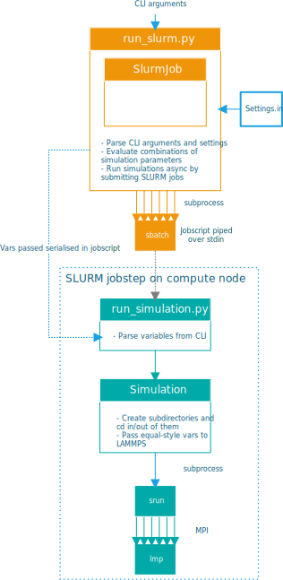

# Lampshade


[](https://zenodo.org/badge/latestdoi/196189551)

Lampshade is a configuration-driven Python wrapper around LAMMPS for more convenient batch submission of simulation jobs.

The Python wrapper makes it possible to define (a list of) simulation parameters in a `settings.ini` file and run
simulations for all (combinations of) parameters in a standard way, in a serial or parallel manner, as defined in
`settings.ini`.

The name is a play on "LAMMPS": it sits around LAMMPS like a lampshade around a lamp.

## Motivation
Lampshade was developed with the idea that the LAMMPS input file for a system should not be modified for running the
system with different parameters. Instead, these parameters can be fed to LAMMPS using variables. However, the list of
variables often grows long, and feeding them as CLI arguments becomes tiresome. Moreover, oftentimes one wants to run a
'parameter sweep' consisting of a range of simulations with different (combinations) of some of these parameters.

Lampshade streamlines this by:

- Allowing the user to configure these parameters in a `settings.ini` file
- Handling creating of subdirectories for each simulation, containing all relevant info
- Spawning a simulation for every combination of parameters in a sweep

Using Lampshade, a large parameter sweep can be started using just one command, with the wrapper handling submission of
SLURM jobs and subdirectory creation, keeping a clean and organised directory structure.

## Installation
Simply clone the repository using Git:

```console
foo@bar:~$ git clone https://github.com/Compizfox/Lampshade.git
```

or download a release and extract it. The Git approach has the advantage that updating is as easy as `git pull`.

### Dependencies
Lampshade requires at least Python 3.6. No further setup is needed (apart from the usual LAMMPS setup, obviously);
Lampshade does not depend on any Python libraries outside the Standard Library.

## Usage
### Placing input file(s)
Place the input file(s) which describe your simulation in the root directory (that is, the same directory the Python
files reside in). For example, your directory tree should read:

Lampshade  
├── Job.py  
├── README.md  
├── run\_simulation.py  
├── run\_slurm.py  
├── settings.ini.example  
├── Simulation.py  
└── **my\_simulation.in**  

### Creating a subdirectory for a job
The wrapper assumes that you create a subdirectory for every "job" (set of simulations corresponding to e.g. a parameter
sweep). Let's create one now:

```console
foo@bar:~/Lampshade$ mkdir my_job
```

In this job directory, the wrapper expects two files: the initial data file and `settings.ini`. The name of the initial
data file is specified in `settings.ini`. Let's copy the included `settings.ini.example` to the subdirectory we just
created:

```console
foo@bar:~/Lampshade$ cd my_job
foo@bar:~/Lampshade/my_job$ cp ../settings.ini.example settings.ini
```

### `settings.ini`
Now, it's up to you to set the correct values in `settings.ini` depending on what you want to do. Here is a quick
rundown of the various variables:

- `LAMMPS_path`: Path to the LAMMPS executable, which is simply `lmp` on most systems. Change this if LAMMPS is
  installed under a different name on your system.
- `LAMMPS_arguments`: Arguments to always pass to LAMMPS. Defaults to `-sf omp` to use the `OMP` versions of styles for
  free speed-up.
- `MPI_path`: Path to the mpirun/srun executable.
- `MPI_arguments` Arguments to pass to the mpirun/srun executable. Empty by default.

- `required_vars`: Space-separated list of variables that need to be passed to LAMMPS. Reflects the variables used in
  the input file.
- `slurm_sbatch_args`: sbatch command for submitting jobs (`SlurmJob` specific). Append to this the appropriate sbatch
  options (such as `-t xx:xx` and `-n x` for the time limit and number of processors respectively).
- `input_file`: Name of the LAMMPS input file
- `log_file`: Name of the log file to write (inside the inner simulation directory)

`[static_vars]` contains LAMMPS variables and their values that are static within a job, i.e. the variables that do not
change in a parameter sweep.

`[dyn_vars]` on the other hand contains the 'dynamic' variables: those that are varied within a parameter sweep.
Values are specified space-separated, and a simulation is spawned for every combination of values.

Two variables have a special meaning: `input_file` and `initial_data_file`, because they represent names of files
residing in directories above the working directory of the simulation. As such, these paths are rewritten automagically
by the wrapper by prepending `../` where appropriate.

### Running
To run a job, execute `run_slurm.py` from the root directory with the name of the job's subdirectory as argument:

```console
foo@bar:~/Lampshade$ ./run_slurm.py my_job
```

The wrapper automatically creates subdirectories inside the job directory for every simulation. The output of the
simulation is placed in these subdirectories. For example:

Lampshade  
├── Job.py  
├── README.md  
├── run\_simulation.py  
├── run\_slurm.py  
├── settings.ini.example  
├── Simulation.py  
├── **my\_simulation.in**  
├── **my\_job**  
│   ├── settings.ini  
│   ├── slurm-9126416.out  
│   ├── data.gz  
│   ├── **grid_epp0.6000\_eps0.2000**  
│   │   ├── log.lammps  
│   │   └── ...  
│   ├── **grid_epp0.6000\_eps0.4000**  
│   │   ├── log.lammps  
│   │   └── ...  
│   └── ...  

Refer to the input for my [Vapour Solvated Polymer Brush](https://github.com/Compizfox/VSPB) simulations for a
 complete example which uses Lampshade.

## Developer documentation
`Job` defines an abstract class for a job (a range of simulations with some specified parameters), including the
argument and setting parser. Simulations are spawned by calling the abstract method `_spawn_simulations()`.

In the current version, the only simulation spawn engine is `SlurmJob` (`run_slurm.py`) which submits SLURM jobs, but it
is possible to e.g. run simulations interactively in serial, or in parallel using multiprocessing, by extending `Job`
and implementing `_spawn_simulations()` as appropriate.

`SlurmJob` generates an 'ephemeral' (not saved anywhere) SLURM jobscript and pipes it to sbatch (with options as defined
by `slurm_sbatch_args` in `settings.ini`). The jobscript contains a call to `run_simulation.py` with
various required JSON-serialized variables as arguments.

`run_simulation.py` (which runs on the compute node at runtime) then JSON-deserializes these variables from `argv`,
instantiates a `Simulation` and calls `run_gcmc()` on it to start the simulation.

A `Simulation` creates a subdirectory and runs LAMMPS in a subprocess with the applicable variables.

Shown below is a diagram illustrating the execution flow:



## License
This project is free software licensed under the GPL. See [LICENSE](LICENSE) for details.
